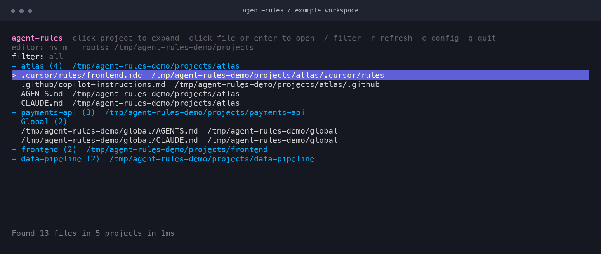

<p>
  <picture>
    <source media="(prefers-color-scheme: dark)" srcset="docs/assets/brand/wordmark-dark.svg">
    
  </picture>
</p>

# agent-rules

**Your agent instructions, one terminal away.**

Find the rules and memory files scattered across your projects, browse them in one place, and open them in your favorite editor. A focused terminal UI built with Go and [Bubble Tea](https://github.com/charmbracelet/bubbletea).

[](https://github.com/natelindev/agent-rules-tui/actions/workflows/ci.yml)
[](https://go.dev/dl/)

[Documentation](https://agent-rules-tui.pages.dev/) · [Report a bug](https://github.com/natelindev/agent-rules-tui/issues/new/choose) · [Contributing](CONTRIBUTING.md)



*The actual TUI running against sample projects. Projects start collapsed; expand only what you need.*

- **One view across tools.** Discover `AGENTS.md`, `CLAUDE.md`, Cursor rules, Copilot instructions, and more.
- **Project context.** Group files by project, with global instructions in their own group. Projects with the most recently changed instructions appear first.
- **Fast repeat launches.** Show cached results immediately, then refresh in the background.
- **Your editor.** Use `nvim` by default, or choose Vim, VS Code, or another editor command.
- **Keyboard and mouse.** Navigate, filter paths, expand projects, and open files without leaving the terminal.
- **Local workflow.** Discovery reads file metadata; files are edited through the editor you choose. No account or hosted service is required.

## Quick start

You need **Go 1.24 or newer** and a terminal on **macOS or Linux**.

```sh
go install github.com/natelindev/agent-rules-tui/cmd/agent-rules@latest
agent-rules --root ~/projects
```

Go installs the executable into `GOBIN`, or the `bin` directory of `GOPATH` when `GOBIN` is unset (usually `~/go/bin`). Add that directory to your shell's `PATH` if needed.

To build from a checkout:

```sh
git clone https://github.com/natelindev/agent-rules-tui.git
cd agent-rules-tui
go build -o agent-rules ./cmd/agent-rules
./agent-rules --root ~/projects
```

Without `--root`, the app scans your home directory, skipping common dependency, build, and system directories. Known global paths are checked separately, including when you specify project roots.

## Everyday use

```sh
agent-rules --root ~/work --root ~/src    # Scan multiple workspaces
agent-rules --editor "code -w"           # Use VS Code for this run
agent-rules --set-editor "code -w"       # Save your preferred editor
agent-rules --warm-cache                 # Refresh discovery without the TUI
```

| Key / action | What it does |
| --- | --- |
| `↑` / `↓` or `k` / `j` | Move the selection |
| `Enter` / `o` or click | Expand a project or open a file |
| `/` | Filter by project name or file path, ignoring case |
| `Enter` / `Esc` while filtering | Finish typing; keep the filter |
| `Backspace` outside filter mode | Clear the filter |
| `PgUp` / `PgDn` or `b` / `f` | Move by a page |
| `g` / `G` | Jump to the first / last row |
| `r` | Rescan |
| `c` | Open the config in your editor |
| `q` / `Esc` / `Ctrl+C` outside filter mode | Quit |

Filtering expands matching projects automatically. It searches names and paths, rather than file contents. GUI editors should use a wait flag (for example, `code -w`) so the TUI resumes after you close the file.

## Configuration

On first run, the app creates `~/.config/agent-rules-tui/config.json`, or `$XDG_CONFIG_HOME/agent-rules-tui/config.json` when set. Press `c` to edit it; restart the app to apply changes.

```json
{
  "editor": "nvim",
  "roots": ["~/work", "~/src"],
  "ignore_path_prompt": false
}
```

This minimal config keeps the built-in discovery patterns, excluded directories, and global paths. Non-empty `include`, `skip_dirs`, and `global_paths` arrays replace their defaults; they do not append to them. Empty arrays fall back to defaults.

```sh
agent-rules --print-config          # Print the config path, not its contents
agent-rules --init-config           # Create defaults; refuse to overwrite a file
agent-rules --config ./rules.json   # Use another config file
```

Editor precedence: `--editor` → config `editor` → `AGENT_RULES_EDITOR` → `AGENT_MEM_EDITOR` → `VISUAL` → `EDITOR` → `nvim`. The generated default config sets `editor` to `nvim`; omit that field to use environment variables on subsequent runs. `vscode`, `vscode-insiders`, and `neovim` are supported aliases.

Discovery metadata is cached at `~/.cache/agent-rules-tui/discovery.json`, honoring `XDG_CACHE_HOME`. Use `cache_path` to override it. File contents are not stored in the cache.

When a directly built `agent-rules` executable is missing from `PATH`, the app offers to create a symlink in `~/.local/bin` and add that directory to your shell rc file if needed. Press `a` to accept, `i` to skip once, or `I` to remember the choice. Keep the original executable in place if you use the symlink.

## Documentation

The [documentation site](https://agent-rules-tui.pages.dev/) includes the complete CLI and configuration reference, supported file patterns, discovery behavior, and troubleshooting. Preview the site locally:

```sh
python3 -m http.server 8000 --directory docs
```

Then open <http://localhost:8000>. The site is plain HTML, CSS, and JavaScript, with no build step. [Publishing instructions](CONTRIBUTING.md#documentation-site) cover Cloudflare Pages deployment and the GitHub Pages mirror.

## Contributing

Bug reports and focused improvements are welcome. See [CONTRIBUTING.md](CONTRIBUTING.md) for development, verification, and screenshot instructions.

```sh
go test ./...
go vet ./...
go build ./cmd/agent-rules
```

Built with [Bubble Tea](https://github.com/charmbracelet/bubbletea) and [Lip Gloss](https://github.com/charmbracelet/lipgloss).
